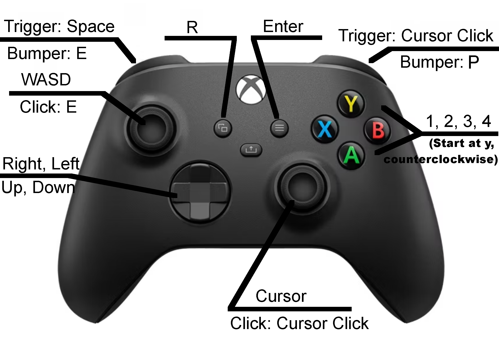

# Forsaken Legends: Cursed Isle

Step into a vibrant pixel-art world of adventure, mystery, and danger. Battle powerful bosses, face off against formidable enemies, and befriend unique characters as you explore diverse environments. Delve into hidden caves, uncover ancient secrets, and solve intriguing mysteries. With a rich, immersive world teeming with animals and challenges, your journey will test your skills, wit, and courage at every turn. Will you uncover the truth and conquer the unknown?

**Official Website:** https://sullydux.github.io/Curse/

**Developer:** [Sullydux](https://github.com/sullydux)

---

## How to Get Started

To get started, wait for the game to load, then press the green flag in the top left. After you press that, it will show a backstory for your character, which you can dismiss by pressing anywhere on the message. Now you are in the game and can play freely. For full control and help guides, press E or I to open the inventory. With the inventory open, you can hover your mouse over the two clipboards with question marks on them in the top right.

---

## Notes on Saving Game on Scratch and Turbowarp

It saves automatically every three minutes or you can press P to save(20 second cooldown between manual saves). When you download your save, you get a string of numbers in your copy & paste clipboard. Place it into a list, document, sticky note, or wherever you like. The game does not internally reload save data, so you have to paste the save back into the game.

---

## Notes on Saving Game on the Website and Download From the Website

On the downloaded version from the website, the game saves automatically every one and a half minutes, or you can press P to save manually (20-second cooldown between manual saves). When you download your save, you get a string of numbers in your copy-and-paste clipboard. Place it into a list, document, sticky note, or wherever you like. You can use this string of numbers to move browsers and devices without losing your game.

When the game saves, the save data goes to local storage in your browser, so you do not have to place the save data in a list, unless you want the safety of that. When you close and reopen the tab, the game will load any stored save data. If you hit reset in the game, your save will also be reset. If you change browsers or devices, your save data WILL NOT transfer. If you clear site data or browsing data, your save WILL BE lost.

---

## Controller Support

This game supports controllers based on Turbowarp's [Gamepad Support Extension](https://turbowarp.org/addons#gamepad). The controller configuration is listed below and is not changeable. With a controller, everything should work except for chests (which are not vital to the game) and saving save data to an external document or list, but that can work if you have a keyboard. The game has been tested on a wireless Xbox Series S controller, but according to Turbowarp, any compatible controller can work.

**Controller Buttons:**
- A — 1, Sets current item to first slot

- B — 2, Sets current item to second slot

- X — 3, Sets current item to third slot

- Y — 4, Moves item to backpack or equips armor and shield

- Left Bumper (LB) — E, Open and closes inventory

- Right Bumper (RB) — P, Manually saves the game(20 second cool down)

- Left Trigger (LT) — Space, Many operations

- Right Trigger (RT) — Click, Many operations

- Left Stick - WASD, Move

- Right Stick - Cursor, Aim and interact

- Left Stick (Press) — E, Secondary

- Right Stick (Press) — Click, Secondary

- D-Pad Up — Up Arrow, Secondary move

- D-Pad Down — Down Arrow, Secondary move

- D-Pad Left — Left Arrow, Secondary move and volume control(see a help menu in game)

- D-Pad Right — Right Arrow, Secondary move and volume control(see a help menu in game)

- View Button (⧉ icon)- R, Takes to reset game screen

- Menu Button (☰ icon)- Enter, Accepts stuff

---

## Credits

- Scratch — For letting me code and share the game
- Turbowarp — For letting me code and package the game to let it be on a website
- BlackFang on pixeljoint.com — Explosion GIF
- 'Menu Music' on pixabay — Day time & inventory music
- 'Glitch in the Dark' on pixabay — Night time & caves music
- 'Raining Village - Video Game Theme' on pixabay — Village music
- 'Fast Paced Boss Battle' on pixabay — Boss fight music
- 'Dragon Roar) High intensity' on pixabay.com — Basaltor's roar

---

## License

This project is licensed under the terms found here:

[View License](https://sullydux.github.io/Curse/LICENSE.txt)